# MediLoan System Architecture & Trust Boundary Specification

## 1. Architectural Overview

The **MediLoan Pilot System** is architected as an asynchronous, event-sourced, privacy-by-design medical monitoring equipment intake and reconciliation engine. It guarantees sub-second interactive latency on front-line terminals, enforces strict least-privilege role-based access control, eliminates clinical PHI storage, and provides tamper-evident auditability.

---

## 2. Component Diagram (Mermaid Specification)

```mermaid
graph TB
    subgraph TB1["Trust Boundary 1: Client Environment"]
        UI["Single Page Web Client<br>(HTML5 / Vanilla CSS / ES6)"]
        Barcode["Barcode / QR Scanner<br>(Sub-second Autocomplete)"]
        UI --> Barcode
    end

    subgraph TB2["Trust Boundary 2: Application API Gateway (FastAPI)"]
        Auth["RBAC & Role Verification<br>(Header Auth / Least Privilege)"]
        RecEngine["Explainable Recommendation Engine<br>(Deterministic Rules + Fallback)"]
        CapService["Capacity & Scheduling Service<br>(Shift & Queue Awareness)"]
        ConfirmGate["Human Confirmation Gate<br>(Mandatory Reason & Justification)"]
        Sanitizer["Input Sanitizer & Tag Validator<br>(Strict Allowlist / Zero Free-text)"]

        UI -- "TLS 1.3 / JSON REST" --> Auth
        Auth --> Sanitizer
        Sanitizer --> RecEngine
        RecEngine --> CapService
        RecEngine --> ConfirmGate
    end

    subgraph TB3["Trust Boundary 3: Secure Relational Data Store (SQLite WAL)"]
        Tables["Relational Schema<br>(devices, loans, checklists, condition)"]
        EventStore["Append-Only Event Store<br>(events table)"]
        Triggers["SQLite Immutability Triggers<br>(PREVENT_UPDATE / PREVENT_DELETE)"]

        ConfirmGate -- "Parameterized SQL" --> Tables
        ConfirmGate -- "State Transitions" --> EventStore
        EventStore --- Triggers
    end
```

---

## 3. Trust Boundaries & Security Enclaves

### Trust Boundary 1: Client Environment (Untrusted)
- **Components**: Web browser running on front-line intake workstations, handheld barcode scanners, mock camera capture modules.
- **Threat Vector**: Malicious client tampering, manipulated payload injection, cross-site scripting (XSS).
- **Security Controls**:
  - Zero local storage of sensitive data.
  - Strict input validation on every input field using typed Pydantic models.
  - Free-text clinical notes fields are completely eliminated from the DOM; only enumerated wear tag chips (`clean_housing`, `scratches_cosmetic`, `strap_frayed`, etc.) are rendered.

### Trust Boundary 2: Application Service Layer (Secure Gateway)
- **Components**: FastAPI asynchronous server running Python 3.13, Pydantic v2 validation pipeline, Recommendation Engine, Capacity Scheduler.
- **Threat Vector**: Privilege escalation, unauthorized status transitions, unvetted recommendation bypasses.
- **Security Controls**:
  - `X-User-Role` validation (`coordinator`, `technician`, `supervisor`, `auditor`). Sensitive operations (overrides, status transitions) reject unauthorized roles with HTTP 403.
  - Fully parameterized SQL queries throughout the repository (zero raw string concatenation, zero SQL injection surface).
  - Safe fallback under uncertainty: If historical baseline $N < 5$, or checklist entries conflict, recommendation automatically defaults to `Escalate — biomed inspection` or `Hold — pending supervisor review`.

### Trust Boundary 3: Data Persistence & Event Log (Enforced Immutability)
- **Components**: SQLite 3.50 database configured with Write-Ahead Logging (`WAL`), strict foreign keys (`PRAGMA foreign_keys = ON`), and database-level immutability triggers.
- **Threat Vector**: Unauthorized record modification, retroactive audit trail alteration, database corruption.
- **Security Controls**:
  - Hardware serial numbers are hashed via SHA-256 upon intake (`serial_hash`); raw serials are never exposed.
  - Zero patient PHI stored in any table: `patient_ref_id` contains only pseudonymous tokens (`PT-ANON-xxxx`).
  - Database triggers `prevent_events_update` and `prevent_events_delete` raise an unrecoverable `SQLITE_ABORT` if an `UPDATE` or `DELETE` is executed against the `events` table.

---

## 4. End-to-End Data Flow Sequence

1. **Intake & Lookup**:
   - Coordinator scans device ID or loan ID.
   - System queries `loans` and `devices`. If no match exists, system **refuses to guess**, halts flow, returns HTTP 404, and immediately persists a `DATA_INTEGRITY_MISMATCH` audit event.
2. **Accessory Reconciliation**:
   - Checklist is dynamically generated from the loan's issue-time manifest (`issued_accessory_manifest_json`).
   - Staff marks each required accessory (`present`, `missing`, `damaged`, `evidence_pending`).
   - Optional photo evidence is attached as an opaque blob URI (`photos/evidence_*.jpg`) and never evaluated for biometric or patient data.
3. **Condition & Wear Capture**:
   - Condition rubric selected: `functional`, `needs_inspection`, `damaged`, `non_functional`.
   - Structured wear tags selected from strict allowlist (`clean_housing`, `scratches_cosmetic`, etc.).
4. **Sanitization Protocol Capture**:
   - Technician logs sanitization stage (`not_started`, `in_progress`, `completed`, `failed`) and technician ID.
5. **Patient / Caregiver Acknowledgement**:
   - Checkbox records that patient acknowledged return condition and accessory counts. If refused or disputed, system flags liability risk.
6. **Recommendation Engine Execution**:
   - Evaluates multi-gate rules hierarchy.
   - Calculates inspectable confidence score $[0.15, 0.98]$.
   - Queries `CapacityService` for upcoming shift slots. If queue is full, identifies next available slot; if all visible shifts are booked, reports capacity exhaustion.
   - Returns explainable `RuleTrailResponse`.
7. **Human Confirmation Gate**:
   - Clinical supervisor reviews recommendation and rule trail.
   - Click **Approve**: Device status updates to target state (`available`, `hold_cleaning`, `hold_missing_accessory`, `escalated_biomed`).
   - Click **Override**: Requires supervisor permission, standard override reason code, and minimum 5-character typed technical rationale.
8. **Immutable Event Logging**:
   - Every lookup, checklist record, condition entry, recommendation, confirmation, and status change appends a tamper-evident record into `events`.
